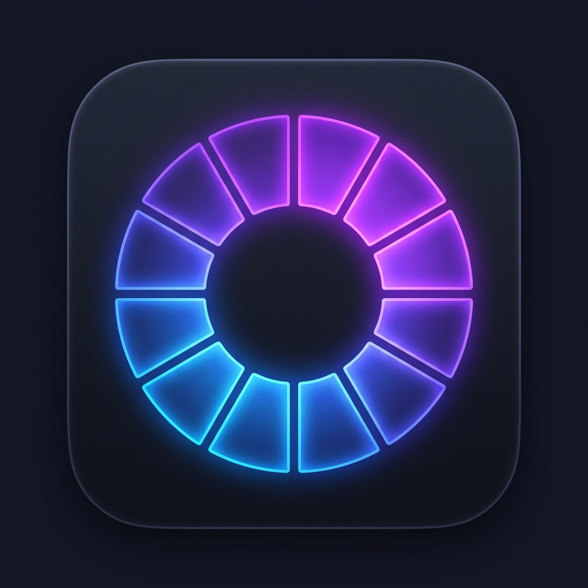

# AeroDisk — Cross-Platform Disk Space Analyzer

AeroDisk is a high-performance, visually stunning storage analyzer built with **Electron**, **TypeScript**, and **Vanilla CSS**. Inspired by utility tools like Filelight and DaisyDisk, it provides a premium interactive sunburst visualization of your filesystem, allowing you to easily discover space-hogging folders and clean up your storage.



---

## Key Features

*   **Interactive Sunburst Chart**: Beautiful, high-DPI canvas-drawn visualization with glowing hover states, fluid segment dimming, and an interactive center displays.
*   **Modern Glassmorphism UI**: Curated dark theme, custom macOS-style draggable titlebar, sleek layout transitions, and file type category icons (documents, code, archives, etc.).
*   **Zero-Setup Default Scan**: Automatically scans the user's home directory (`~/`) on startup so the dashboard is immediately populated.
*   **Blazing-Fast Directory Parsing**: Multi-threaded scanner (running in a background Node `worker_thread` to keep the UI perfectly responsive) optimized to exclude heavy system cache directories (`Library` on macOS, `AppData` on Windows).
*   **Drag-and-Drop Scanning**: Drag any folder from Finder or File Explorer and drop it anywhere inside the window to analyze it instantly.
*   **Contextual Operations**: Click the vertical three-dot button `⋮` (or right-click) on any row to **Open Folder**, **Reveal in Finder/Explorer**, or **Move to Trash**.
*   **Modern Toast Notifications**: Slide-in success/failure alerts with a counting-down progress bar to track file deletions cleanly.
*   **Developer Hot-Reload Environment**: Single-command development pipeline (`yarn dev`) that auto-compiles TypeScript and reloads the Electron app on code changes.
*   **Native Cross-Platform API**: Uses native Node.js `fs.statfsSync` and physical block allocation measurements instead of shell command execution (`df`), ensuring compatibility across macOS, Windows, and Linux.
*   **Automatic OS Signing Hook**: Automatically runs an ad-hoc code-signing script on package installation to prevent macOS Gatekeeper blocks ("app is damaged" / "malware" crashes).

---

## Project Structure

```
AeroDisk/
├── dist/                  # Compiled assets (JS, HTML, CSS, PNG) ready for Electron
├── scripts/
│   ├── build.js           # Cross-platform production build and asset copier
│   └── watch.js           # Development watcher (spawns tsc --watch & hot-reloads Electron)
├── src/
│   ├── assets/
│   │   └── favicon.png    # Modern icon asset
│   ├── styles/            # Modularized stylesheets
│   │   ├── styles.css     # Main style entry point
│   │   ├── base.css       # Reset & CSS variables
│   │   ├── titlebar.css   # Draggable title controls
│   │   ├── sidebar.css    # Sidebar navigation and cards
│   │   ├── workspace.css  # Main dashboard layout and states
│   │   └── components.css # Lists, menus, dialogs, and toasts
│   ├── main/
│   │   └── main.ts        # Electron main process (IPC handlers, window creation)
│   ├── preload/
│   │   └── preload.ts     # Preload bridge exposing type-safe window.api
│   ├── worker/
│   │   └── scan-worker.ts # Multi-threaded recursive folder scanner
│   └── renderer/
│       ├── index.html     # Semantic layout and modal markup
│       └── renderer.ts    # Chart canvas drawing, UI controllers, drag-and-drop
├── tsconfig.json          # TypeScript compiler configuration
├── package.json           # Dependencies and build script register
└── yarn.lock              # Yarn lockfile
```

---

## Prerequisites

Ensure you have the following installed on your machine:
*   [Node.js](https://nodejs.org) (v18.15.0+ or v20+)
*   [Yarn](https://yarnpkg.com) (v1.22.x or modern)

---

## Getting Started Locally

### 1. Install Dependencies
Run the installation command in the project directory. This will download dependencies, install TypeScript types, and automatically trigger the macOS ad-hoc signing script to authorize Electron on your machine:
```bash
yarn install
```

### 2. Launch Development Watcher (Recommended)
To run the app with automatic compiler watching and live window refreshes, type:
```bash
yarn dev
```
Making modifications to any file under `src/` (TypeScript, HTML, CSS, or image assets) will compile and hot-reload the window instantly.

### 3. Production Build
To run a clean production compile and copy static assets:
```bash
yarn build
```
This output is placed under the `/dist` directory.

### 4. Start Compiled App
To run the compiled production bundle directly (without starting watchers):
```bash
yarn start
```

---

## Technical Details

### Real Disk Space vs Logical Size
The multi-threaded scan worker calculates sizes based on actual blocks allocated on disk (`stats.blocks * 512 bytes`) rather than the logical file size. This yields accurate physical storage statistics matching system commands like `du`.

### macOS Permissions
The first time you attempt to scan a folder like `Desktop`, `Documents`, or `Downloads`, macOS will trigger a permission prompt. Click **OK**. If you scan your entire home directory and want to prevent repeated alerts, add **Terminal** (or **Electron**, if showing up) to **System Settings → Privacy & Security → Full Disk Access**.
