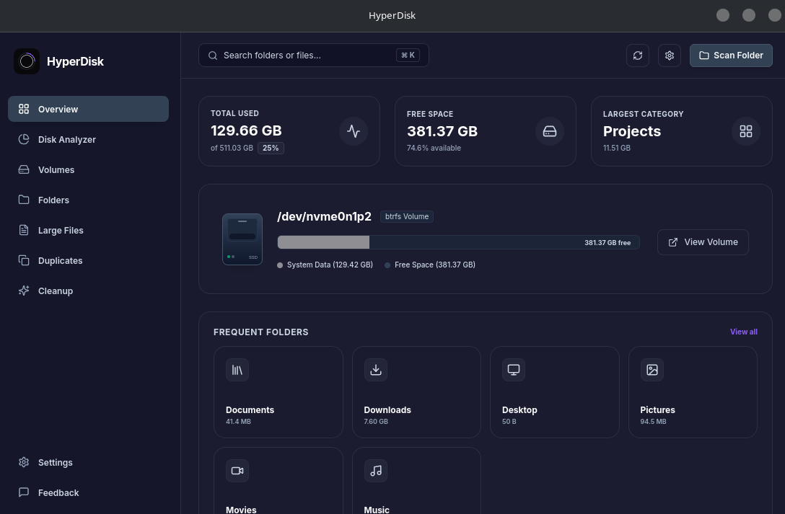
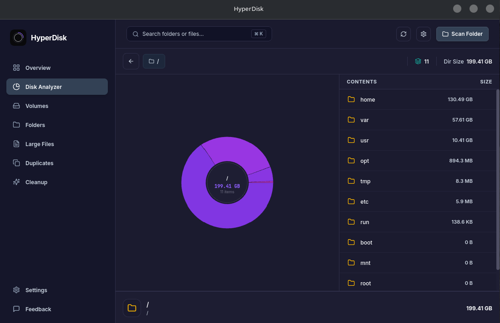

# HyperDisk

HyperDisk is a high-performance desktop disk usage analyzer built to help you inspect storage, identify large files and folders, and clean up disk space with confidence.

### HyperDisk Home Page


---

### HyperDisk Analyzer Page


---

## What HyperDisk Does

- Scan folders or drives and show storage usage in a visual layout.
- Display an interactive sunburst chart and file list for easy exploration.
- Reveal selected items in the native file manager.
- Provide search, breadcrumb navigation, and safe deletion to Trash.

---

## Installation

### Linux and macOS (One-line installer)
You can install, update, or uninstall HyperDisk on Linux or macOS with a single command:

* **Install / Update to latest version:**
  ```bash
  curl -fsSL https://raw.githubusercontent.com/sadid56/HyperDisk/main/install.sh | bash
  ```
* **Uninstall:**
  ```bash
  curl -fsSL https://raw.githubusercontent.com/sadid56/HyperDisk/main/install.sh | bash -s -- --uninstall
  ```

For macOS users: The one-line installer automatically removes quarantine flags to bypass Gatekeeper. However, you still need to grant Full Disk Access permissions (see the [macOS Installation & Permission Guide](INSTALL.md) for detailed steps).

---

## Run HyperDisk Locally

Follow these steps to set up and run the project locally.

### 1. Install Rust
Tauri requires Rust to compile the native backend.

Run the following in your terminal:
```bash
curl --proto '=https' --tlsv1.2 -sSf https://sh.rustup.rs | sh
```

---

### 2. Install System Dependencies


#### Linux (Arch Linux)
```bash
sudo pacman -S --needed base-devel curl wget file openssl appmenu-gtk-module libappindicator-gtk3 librsvg webkit2gtk-4.1
```

#### Linux (Debian/Ubuntu)
```bash
sudo apt-get update
sudo apt-get install -y libsoup-3.0-dev webkit2gtk-4.1-dev build-essential curl wget file libssl-dev libgtk-3-dev libayatana-appindicator3-dev librsvg2-dev
```

#### Linux (Fedora)
```bash
sudo dnf groupinstall "Development Tools"
sudo dnf install webkit2gtk4.1-devel openssl-devel curl wget file libappindicator-gtk3-devel librsvg2-devel
```

---

### 3. Install pnpm
Make sure Node.js is installed on your system. Then, install `pnpm` globally if you haven't already:
```bash
npm install -g pnpm
```

---

### 4. Install Project Dependencies and Run
Once Rust, system dependencies, and `pnpm` are ready, run:

```bash
# Install dependencies
pnpm install

# Run the project in development mode
pnpm tauri dev
```

---

## Contributing

- Fork the repository and create a feature branch.
- Follow the steps above to run locally and test your changes.
- Open a pull request with a clear summary of your changes.
- Report issues or suggest improvements through the repository issue tracker.

---

## License

[MIT](LICENSE) © Sadid
